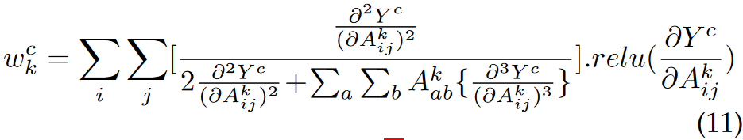
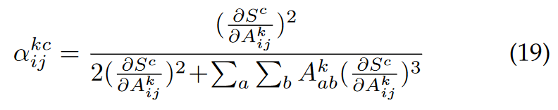

<head>
    
    
</head>

# Discussion: Computation Analysis of GradCAM++

According to the paper [Grad-CAM++](https://arxiv.org/abs/1710.11063) published in WACV 2018,
the proposed method adopts a more rational pixel-wise map weight design,
which serves as one of the key improvements from the original Grad-CAM method.
In the paper, the pixel-wise weight is determined as follows:

    
    
Determination of the pixel-wise map weight.

Such weight determination containing third-order derivative is converted to the following equation:

    
    
Converted determination of the pixel-wise map weight.

This conversion solves the problem of disability of deep learning libraries on high-order derivative calculations.
In this blog, there are discussions about this conversion (stated in Section 3.3 in the paper).

In ordinary network structures (e.g. VGG, ResNet),
modules after the target conv layer (usually being the last conv layer) include average pooling, linear and ReLU layers.
Other activation functions are seldom adopted.
Therefore, one of the assumptions of this conversion is that
the target conv output goes through only linear or piecewise linear operations in the network.

Let $S$ be the combination of operations after the target conv layer,
according to the above assumption, $S$ is linear or piecewise linear.
Therefore,

$$
\frac{\partial^2 S(x)}{\partial x^2}=0
$$

Let $Y$ be the final scores of all classes.
In both Grad-CAM and Grad-CAM++, $Y$ is closely related to the output of the network.
In Grad-CAM++, $Y$ is the exponential classification result.
Therefore, the target first-order derivative is calculated as follows
(which can be auto-calculated by deep learning libraries):

$$
\frac{\partial Y}{\partial x}=\frac{\partial Y}{\partial S}\times\frac{\partial S}{\partial x}
$$

Given that the higher-order derivative equals 0,
the target higher-order derivative is calculated as follows:

$$
\frac{\partial^2 Y}{\partial x^2}=\frac{\partial^2 Y}{\partial S^2}\times \frac{\partial S}{\partial x}+
\frac{\partial Y}{\partial S}\times 0=\frac{\partial^2 Y}{\partial S^2}\times (\frac{\partial S}{\partial x})^2
$$

Given $Y=e^S$, $\frac{\partial Y}{\partial S}=Y$, therefore:

$$
\frac{\partial^n Y}{\partial x^n}=Y\times (\frac{\partial S}{\partial x})^n
$$

and the conversion is complete.

In conclusion, there are two main constraints (or assumptions) in the conversion process:
- There should be only linear and activation layers after the target conv layer.
- Activation function should be piecewise linear.
- Mapping from the raw output to scores should be differentiable with second-order derivative not equal to 0.

For constraint 2, it does not mean that higher-order derivative exists only without non-linear activation functions.
However, with non-linear functions, higher-order derivative is still calculable.
Let several linear layers $L_1$, $L_2$, ... and ReLU layers $R_1$, $R_2$, ...
make up the operations after the target conv layer.
For each linear-activation pair $p=(L_i,R_i)$,

$$
p'=L_i'\times R_i' \\
p''=L_i''\times R_i' + L_i'\times R_i''=L_i'\times R_i'' \\
p^{(n)}=L_i'\times R_i^{(n-1)}
$$

$L_i'$ is auto-calculated, while $R_i^{(n-1)}$ is calculable given $R_i$.
However, complexity of this occasion is much higher than that in the paper.

**References:** Aditya Chattopadhyay, Anirban Sarkar, Prantik Howlader and Vineeth N Balasubramanian "Grad-CAM++: Improved Visual Explanations for Deep Convolutional Networks" proceedings of IEEE Winter Conf. on Applications of Computer Vision (WACV2018).

[return](../../blogs.md)

[return to main](../../../index.md)

