<head>
    
    
</head>

# Experiments: Hybrid Images, Harris Corner Detector and Image Stitching

[return to main](../../../index.md)

[return](../../blogs.md)

These are experiments on hybrid images, Harris corner detector and image stitching
(all typical computer vision applications).

### Hybrid images

The typical image pair (i.e. Marilyn Monroe and Albert Einstein) for hybrid images are used.
The aim is to construct a hybrid image that looks like Einstein if seen at a distance,
and Monroe if seen closely.

    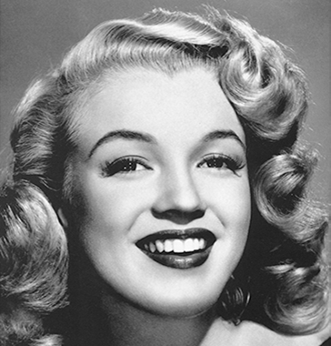
    
    
Images used for hybrid.

The constructed hybrid image should have low-frequency features of Einstein
and high-frequency features of Monroe.

Gaussian filters are used to filter out the high-frequency and low-frequency features of the images.
The filters have the same shapes as the images, and are directly applied to the frequency-domain graphs.
The high-frequency filter is represented by:

$$
filter_{high}=1-filter_{low}
$$

The hybrid images are constructed by addition of the two filtered images.

The constructed hybrid image is shown as follows,
with `sigma=5` for the low-frequency filter and `sigma=25` for the high-frequency filter.

    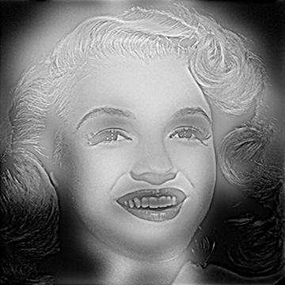
    
The constructed hybrid image.

If multi-level filtering is adopted (i.e. the filtered image is filtered again with the same filter),
the features will be purer but fewer, as shown as follows.

    
    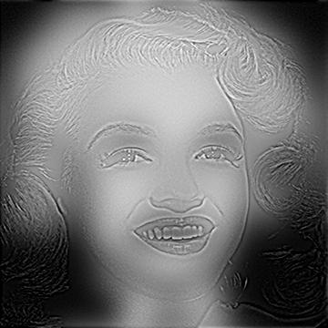
    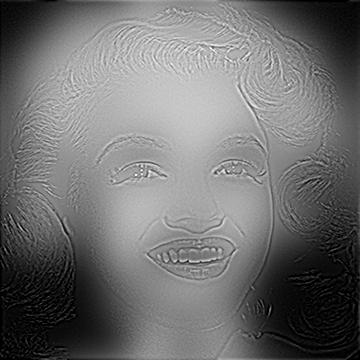
    
Results with different levels of filtering.

[code](hybrid.m)

### Harris Corner Detector

The aim is to locate all corners in an image, using the Harris corner detector.

According to the Harris corner detector, the cornerness of pixel $(x,y)$ is shown as follows,
in which $I^{mn}$ is the dot product of the filtered image gradient along the $m$ and $n$ axes.

$$
cornerness_{ij}=det(H_{ij})-k\cdot trace^2(H_{ij})
$$

$$
H_{ij}=
\begin{bmatrix}
I^{xx}_{ij} & I^{xy}_{ij} \\
I^{xy}_{ij} & I^{yy}_{ij} \\
\end{bmatrix}
$$

For every pixel $(i,j)$ in the image, if its cornerness is beyond a threshold, it is considered a corner.

The illustration image and the detected corners are shown as follows:

    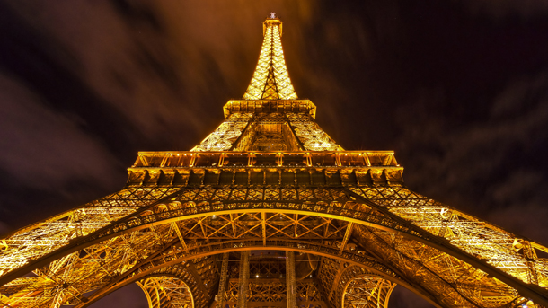
    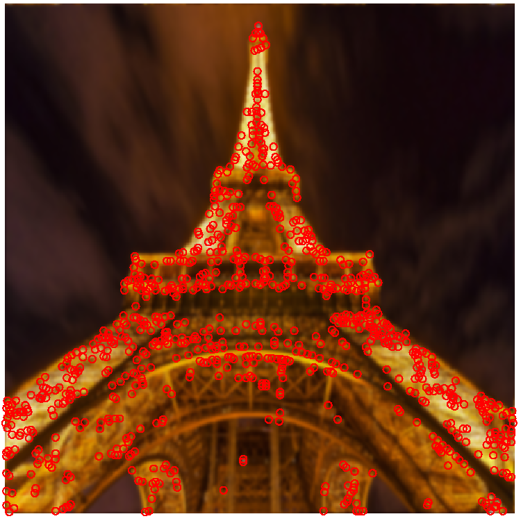
    
The illustration image and the detected corners.

Results with the upscaled, downscaled, rotated and translated images are shown as follows:

    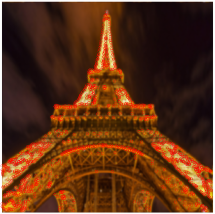
    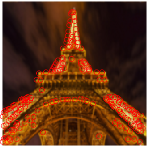
    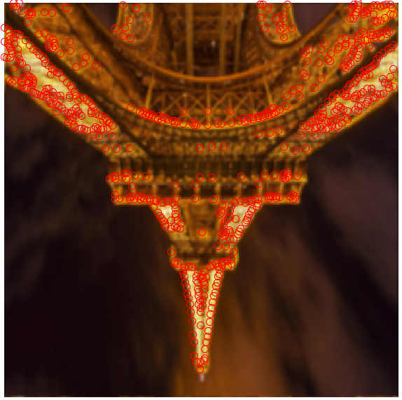
    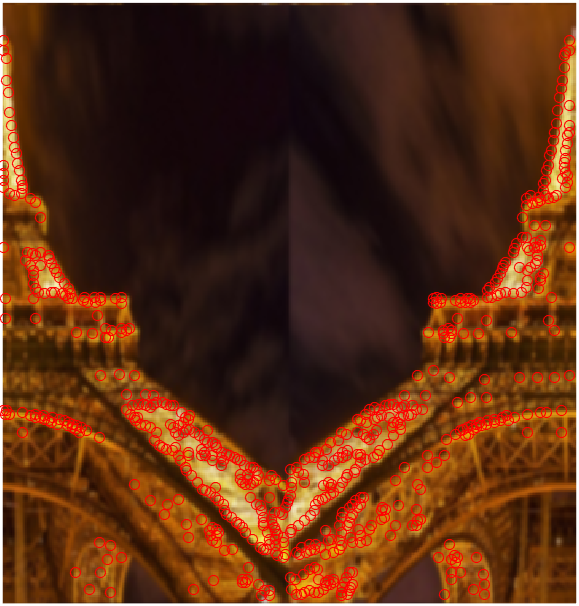
    

        Results with the upscaled, downscaled, rotated and translated images.
    

It is obvious that the Harris corner detector is not influenced from rotation or translation,
but is heavily affected by scaling.

[code](harris_corner_detection.m)

### Image Stitching

The aim is to combine the two images in one scene with different views
(but with shared patches).

First, multiple pairs of correspondences are selected.
The correspondences are mostly corners (convenient for manual selection).
Based on the correspondences, the homography matrix ***H*** is determined using least-squares method.
$x^m_n$ and $y^m_n$ are the x and y coordinates of the nth point in the mth picture.

$$
\begin{bmatrix}
x^2_1 & y^2_1 & 1 & 0 & 0 & 0 & -x^1_1x^2_1 & -x^1_1y^2_1 \\
0 & 0 & 0 & x^2_1 & y^2_1 & 1 & -y^1_1x^2_1 & -y^1_1y^2_1 \\
x^2_2 & y^2_2 & 1 & 0 & 0 & 0 & -x^1_2x^2_2 & -x^1_2y^2_2 \\
0 & 0 & 0 & x^2_2 & y^2_2 & 1 & -y^1_2x^2_2 & -y^1_2y^2_2 \\
\vdots & \vdots & \vdots & \vdots & \vdots & \vdots & \vdots & \vdots \\
x^2_n & y^2_n & 1 & 0 & 0 & 0 & -x^1_nx^2_n & -x^1_ny^2_n \\
0 & 0 & 0 & x^2_n & y^2_n & 1 & -y^1_nx^2_n & -y^1_ny^2_n \\
\end{bmatrix}
h=
\begin{bmatrix}
x^1_1 \\
y^1_1 \\
x^1_2 \\
y^1_2 \\
\vdots \\
x^1_n \\
y^1_n \\
\end{bmatrix}
$$

$$
H=
\begin{bmatrix}
h_{11} & h_{12} & h_{13} \\
h_{21} & h_{22} & h_{23} \\
h_{31} & h_{32} & 1 \\
\end{bmatrix}
$$

After determination of ***H***, one image is transformed to the plane of the other image
(the image may not be big enough to hold all pixels of the transformed image,
so a bigger canvas may be necessary).

Inverse transform (multi-to-one) is adopted instead of direct transform (one-to-one).
$C_s$ and $C_t$ are the coordinates of the point pair $s$ and $t$
respectively from the projected image (i.e. source) and the canvas (i.e. target).

$$
C_t=HC_s \ \ \text{(direct transform)} \\
C_s=H^{-1}C_t \ \ \text{(inverse transform)} \\
$$

In direct transform, there are pixels on the canvas
that may not correspond to any pixel in the transformed image (without approximation),
which may result in holes in the combined image.

The illustration images and the combined image is shown as follows:

    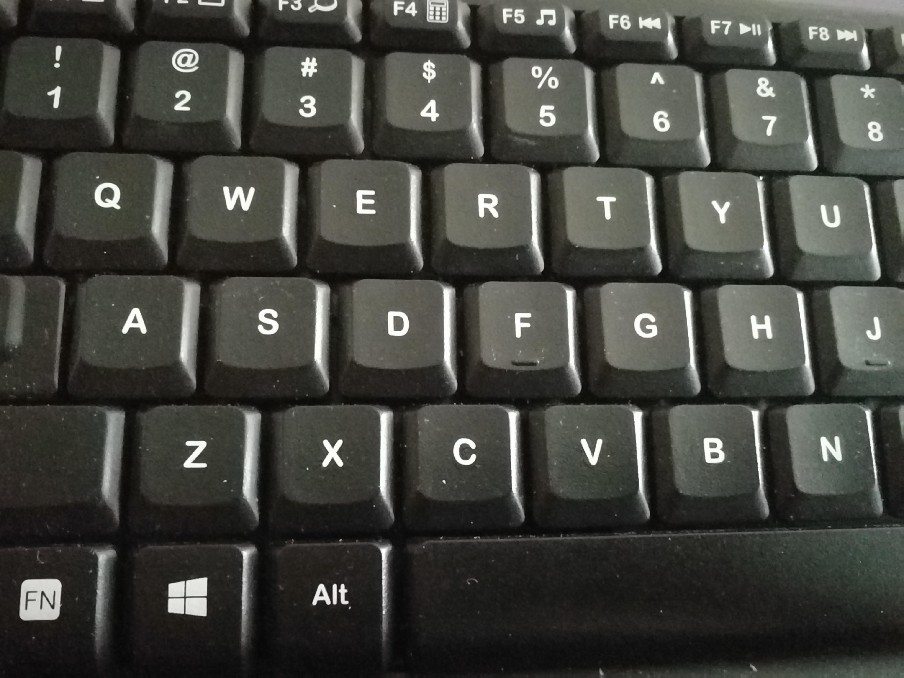
    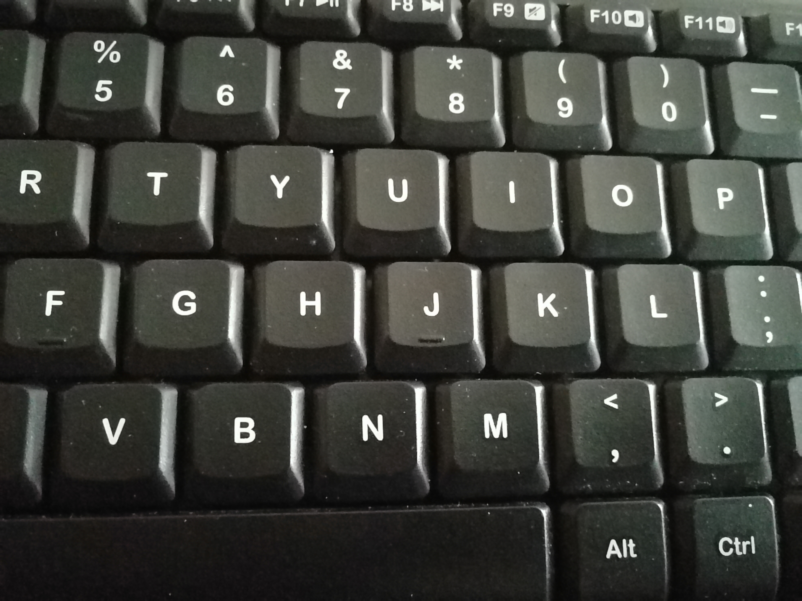
    
Images from different views for combination.

    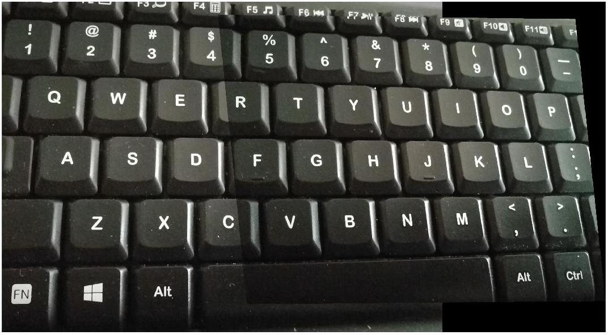
    
The combined image.

[code](stitching.m)

**References:**

Oliva, Aude, Antonio Torralba, and Philippe G. Schyns. "Hybrid images." ACM Transactions on Graphics (TOG) 25.3 (2006): 527-532

[return](../../blogs.md)

[return to main](../../../index.md)
