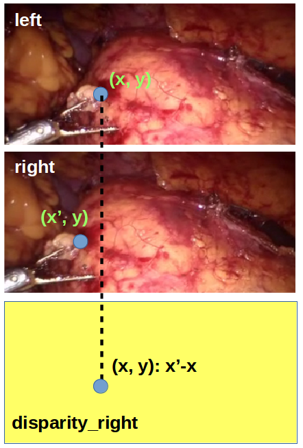

# Paper: Unsupervised Monocular Depth Estimation with Left-Right Consistency

[Return to main](../../../index.md)

[Return](../../blogs.md)

**From**: CVPR2017

**Problem**:

Monocular depth estimation requires huge amounts of depth gts, which is hard to obtain

**Idea**: Unsupervised depth estimation by stereo reconstruction

**Solution**:

*Monodepth* Stereo reconstruction: stereo data for training; monocular testing.
In training, left gt as input, left and right disparity maps as output.
Disparity maps show the coordinate shift of pixels along the X axis.

    
    
Exemplary left disparity map.

Given the predicted disparity maps, the image is reconstructed by **sampling**.
The left image is reconstructed by sampling on the right gt (according to left disparity);
the right image is reconstructed by sampling on the left gt (according to right disparity).

Although the input contains only the left gt,
**left and right disparity maps are both predicted,
and the corresponding left/right images are both reconstructed.**
This is to reduce the artifacts on edges of objects:
there are parts (especially edges) of objects that are occluded in one view but visible in the other.
Mere sampling on image of one view may cause artifacts on such parts.
Although only one view is available in testing,
the simultaneous mutual prediction can reduce the artifact to some extent,
by making more accurate disparity predictions.

Apart from direct image quality assessment (L1 and SSIM),
*Monodepth* also involves:

- gradient smoothness.
Generally, disparity should be continuous unless near objects.
Smoothness of disparity estimations is evaluated globally
unless in locations with high pixel gradient (usually marking edges of objects).
- left-right consistency.
Left and right disparity maps have internal relationship
(in no-object scenes, the two maps should be just opposite).
In scenes with objects, the projection of the left disparity map to the right view
(according to the right disparity map) should be equal to the right disparity map, vice versa.

The above three aspects serve as three components of criteria in *Monodepth* training.

**References:**

Godard, Clément, Oisin Mac Aodha, and Gabriel J. Brostow. "Unsupervised monocular depth estimation with left-right consistency." Proceedings of the IEEE Conference on Computer Vision and Pattern Recognition. 2017

[Return](../../blogs.md)

[Return to main](../../../index.md)
