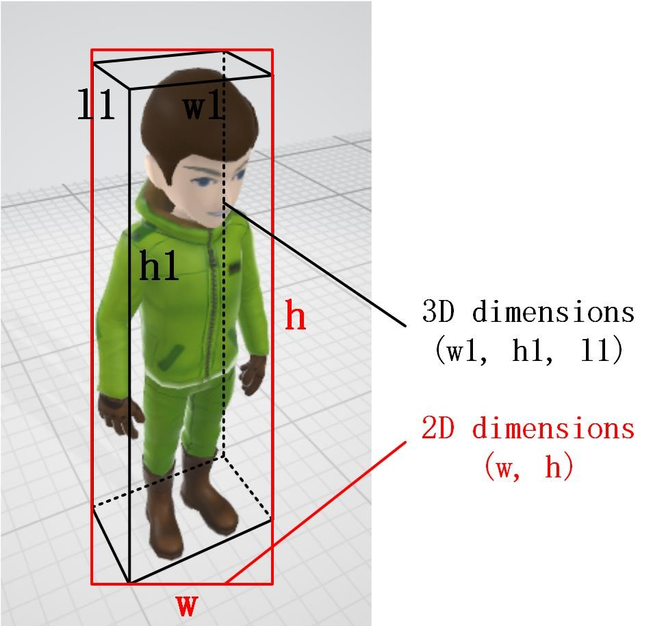
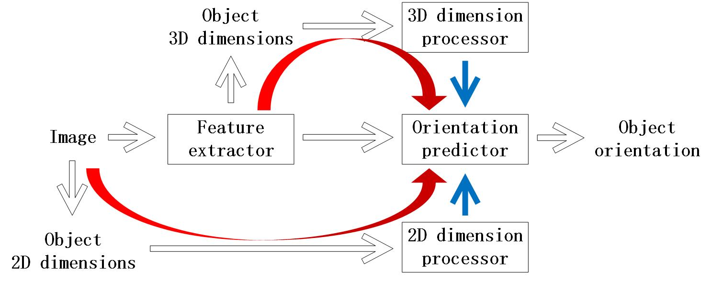
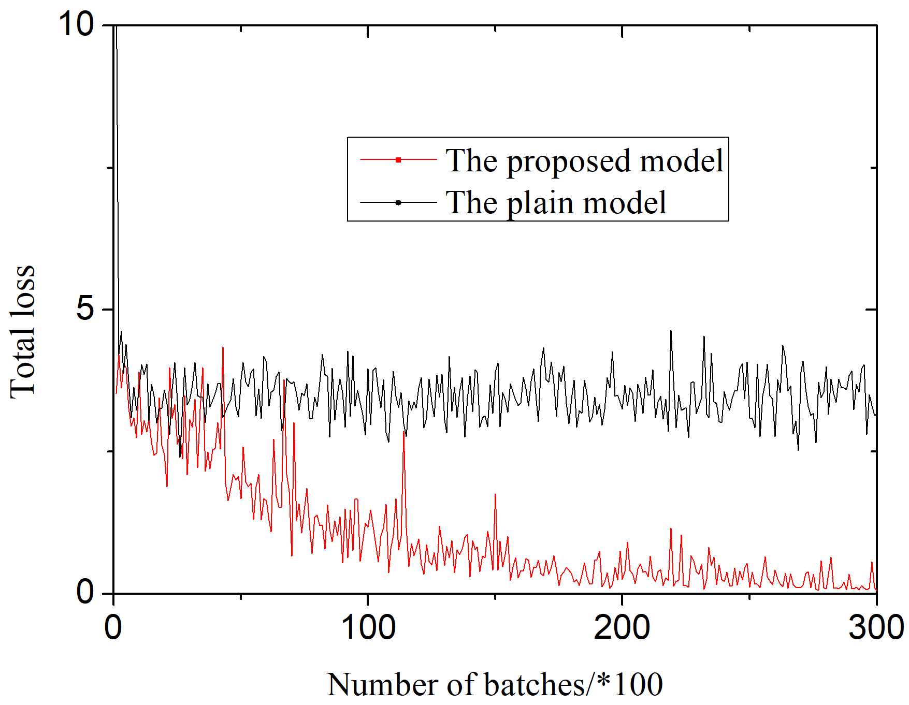
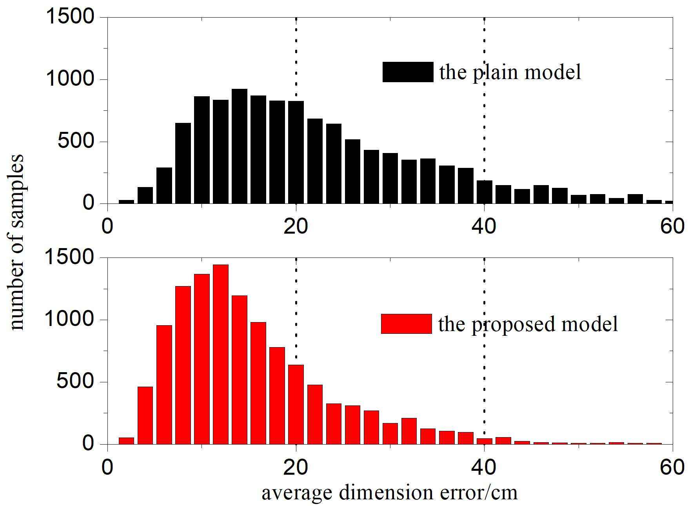
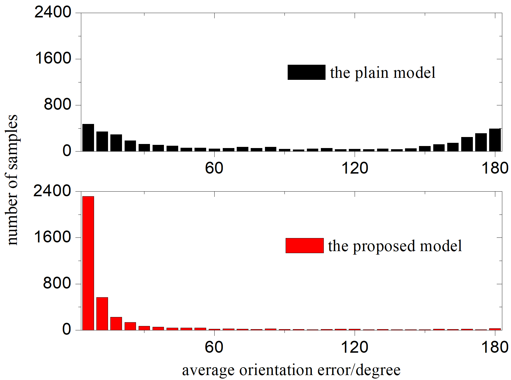

# 2D Monocular Object Detection and Orientation Estimation

[return to main](../../../index.md)

[return](../../research_exp.md)

This work is applied to traffic recognition.
The related model participated in the [KITTI](http://www.cvlibs.net/datasets/kitti/)
[2D Object Detection Evaluation 2012
challenge](http://www.cvlibs.net/datasets/kitti/eval_object.php?obj_benchmark=2d).

Existing 2D object orientation estimation models have much lower performance than 2D object detection models.
An important reason is that orientation estimation requires more and deeper features
which are hard to obtain for object detection models with only orientation estimation branch added.

According to principles of perspective,
the width of an object in the image plane has close relationship with its orientation.
Therefore, object width information, combined with its 3D dimensions
(which are determined in the first stage of the same process) can be used to determine its orientation.

    
    
There is relationship between the 2D width of an object and its orientation.

In the proposed model, 2D dimensions of the object are predetermined labels
which are not used in existing orientation estimation models.
3D dimensions of the object are determined by the same network in the first stage of the process.
Both information groups are inputted to the second stage of the network.

    
    
Flowchart of the whole process.

Comparisons between the proposed model and the plain model
(i.e. the same structure without the 2D and 3D dimensions input)
show that adoption of perspective principles (a form of prior knowledge)
increases performance of the network.

    
    
    
    
Comparisons between the proposed model and the plain model in loss convergence and error distribution.

The related model participated in the [KITTI](http://www.cvlibs.net/datasets/kitti/)
[2D Object Detection Evaluation 2012
challenge](http://www.cvlibs.net/datasets/kitti/eval_object.php?obj_benchmark=2d)
and obtained [rank 9th](http://www.cvlibs.net/datasets/kitti/eval_object_detail.php?&result=179771366d64fe59a16f210bca0fc30b4daca932).

Paper:

***[Monocular Pedestrian Orientation Estimation Based on Deep 2D-3D Feedforward](https://www.sciencedirect.com/science/article/abs/pii/S0031320319304820?via%3Dihub)***

[return](../../research_exp.md)

[return to main](../../../index.md)
