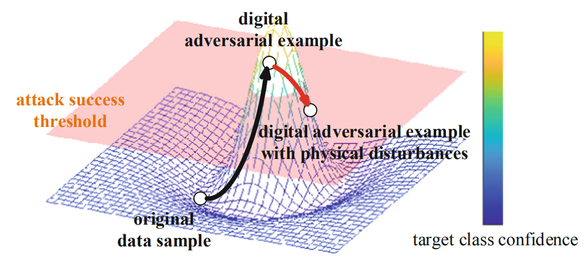
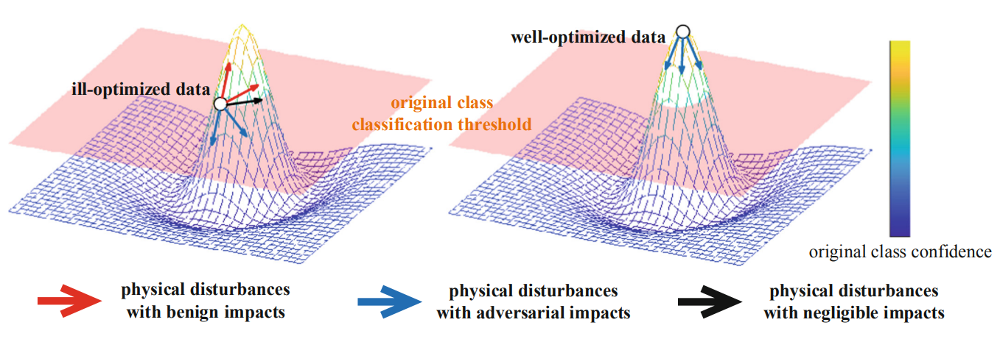
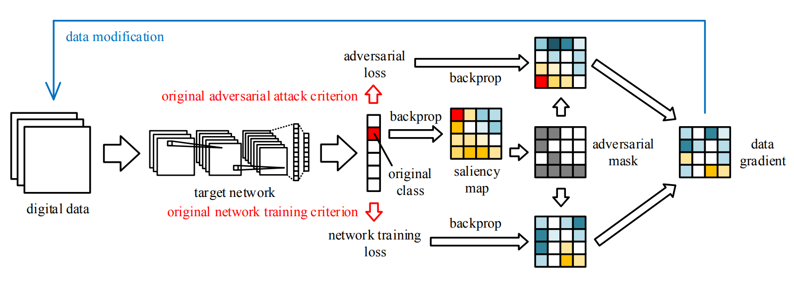

# Stable Physical Adversarial Attacks and Defenses

[return to main](../../../index.md)

[return](../../research_exp.md)

This work is applied to physical adversarial attacks and defenses.

*What are **physical** adversarial attacks and defenses? **Physical** adversarial attacks craft **physical** adversarial objects from adversarial data, and try to attack **physical** systems by exposing their sensors to such objects. **Physical** adversarial defenses aim to defend against physical adversarial attacks. However, there seems to be no literally 'physical' adversarial defense methods.*

Existing adversarial attack methods perform well on digital data. However, in order to actually attack real-world processing systems, they need to convert the generated digital adversarial samples into actual objects (e.g. crafting or printing) to be captured by target systems. In the crafting/printing and recapturing process, **external noise (i.e. physical disturbances, e.g. errors in crafting and captures) may reduce the aggressiveness of adversarial perturbations**. This may be more severe given the general adversarial objective that adversarial perturbations should be as imperceptible as possible. So, the question is: **how to reduce the influence of physical disturbances with low-amplitude adversarial perturbations?**

Existing physical attack methods (e.g. Expectation over Transformation, EoT) solve the problem via general optimizations. In each iteration, a randomly selected type of noise (e.g. affine, gaussian-noise, low-res) is injected into the original adversarial example. Through gradient-based optimizations, the adversarial example gradually survives all types of noise. However, such methods have two drawbacks: bad performance under unforeseen conditions; high computational cost in physical condition simulation.

This work presents a simulation-free method named Pixel-wise Adversarial Learning based Physical Attack (P-ALPhA).

Let's first see how the aggressiveness of adversarial examples may vanish. In cases of aggressiveness vanishing, physical disturbances drag the original adversarial example off the local maximum and even the plane of attack success threshold.

    
    
The black adversarial perturbation makes the sample aggressive, and the red physical disturbance drags the sample off the local maximum.

Now, we may think about the relationship between the impact of physical disturbances and the location of the adversarial example on the manifold. An ideal case is that the sample is located on the global maximum of the manifold. In this case, any perturbation may drag the sample off the ideal location and reduce the classification probability (i.e. adversarial).

    
    
Physical disturbances may also have positive impacts given specific locations of data.

Now, we want a sample both benignly well-optimized and adversarial. How to do that? We use adversarial learning. Since these operations are all on one single image, this adversarial learning technique is conducted on image pixels (i.e. pixel-wise). Since the two objectives are in conflict with each other, we have to make some of the pixels to be adversarial, and others to be benignly optimized. How to divide the image?

We know that even one pixel may turn an image adversarial, but physical disturbances may affect many pixels. Therefore, we choose to compute the sensitivity of each pixel according to its absolute gradient. We then make low-sensitivity pixels adversarial, and make high-sensitivity pixels benign. They have exactly opposite optimization objectives.

    
    
The overall structure of P-ALPhA.

Combined with Projected Gradient Descent (PGD), P-ALPhA can reach almost 100% survival rate (ratio of physically adversarial examples to all examples) against simulated illumination, gaussian noise and resolution reduction. It is quite interesting that adversarial examples can be well-optimized with the seemingly very unstable adversarial objectives.

Paper:

***[Condition-Invariant Physical Adversarial Attacks via Pixel-Wise Adversarial Learning](https://link.springer.com/chapter/10.1007/978-3-030-92270-2_32)***

[return](../../research_exp.md)

[return to main](../../../index.md)
