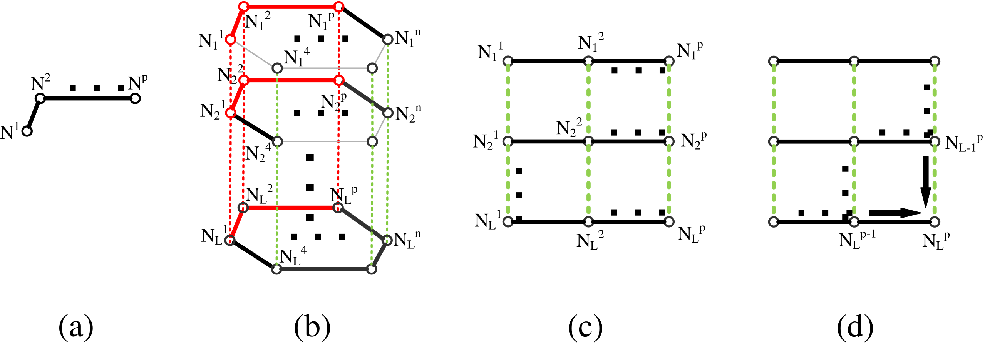
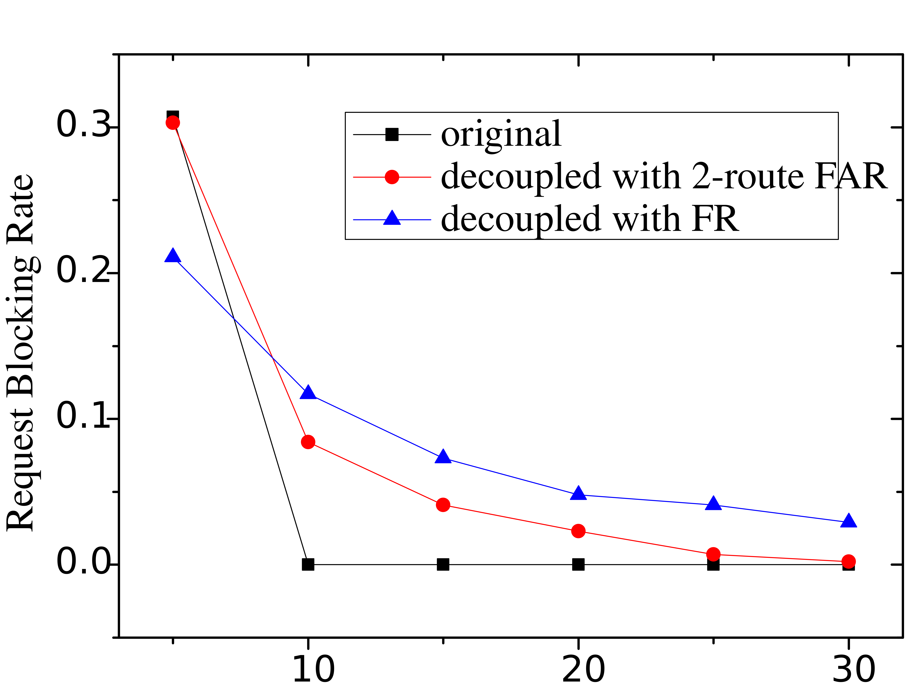
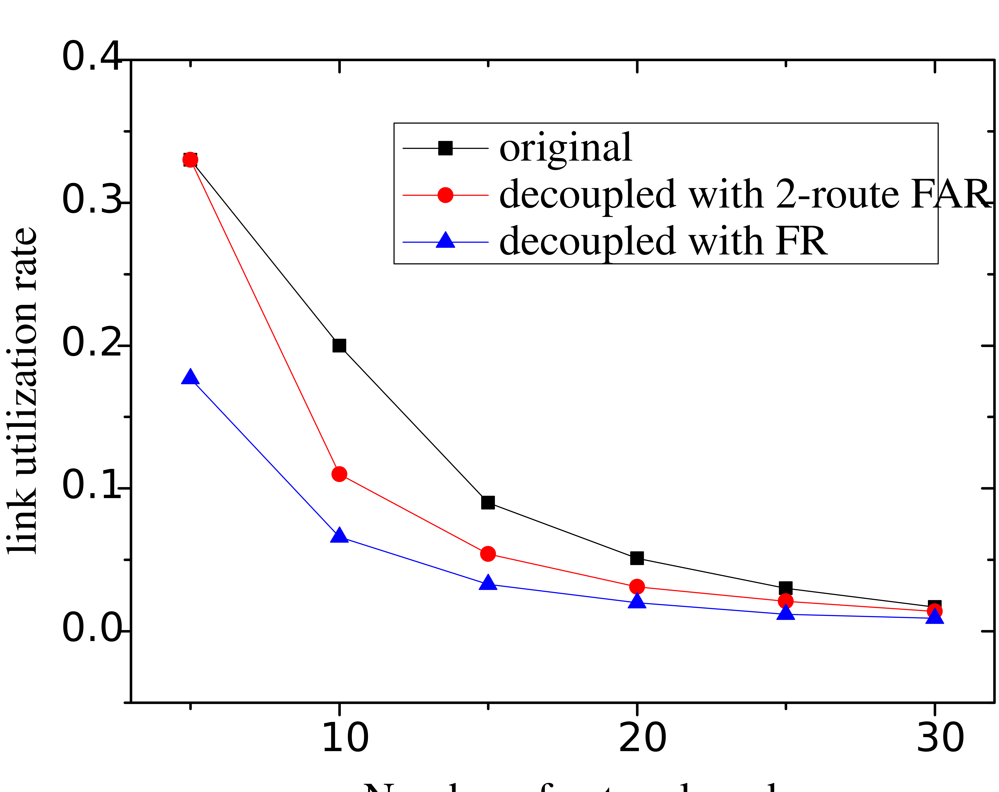

# Research on Decoupling and its Impact on Performance and Complexity of Optical Circuit-Switched Network Models

read **[improvements on data structures and scheduling algorithms](scaling_up.md)** first !

Choices of adjacency list and BFS have a huge defect: unqualified for weighted networks.
Since almost all network topologies are weighted graphs,
the improvements can only be used in simulations instead of applications.
In this research, a different path is investigated - ***decoupling***.

Decoupling is a thought of splitting a tough problem
into two (or more, called decomposition) easier sub-problems
and solving it by respectively solving the two sub-problems.
Decoupling usually results in ***lower complexity of the problem***,
but also leads to ***failure to obtain universal optimal solutions***.

In case of SnF, the process is decoupled into ***spatial routing*** and ***temporal routing*** sub-problems.
The spatial sub-problem is solved before the temporal one.

After decoupling, the spatial routing sub-problem requires no temporal information to solve.
Therefore, the request scheduling algorithm is performed on ***only one layer***
(***the first layer*** in TS-MLG).
All layers of TS-MLG share the same spatial route.
The temporal routing problem becomes a problem of
deciding the timepoints of transferring the request through each link in the route.
Decoupling greatly reduces the size of the graph on which the shortest-path algorithm is performed.
In special occasions in which fixed routing (FR) or fixed alternate routing (FAR) is adopted,
decoupling reduces the time complexity to O(1).

    
    
The decoupling process.

Consider deleting all links irrelevant to the spatial route from the TS-MLG.
The 3D model becomes a graph which can be spread to form a planar graph,
which is called ***longitudinal graph***.
Since it is unreasonable to transfer a request through a link at one time,
and transfer it back afterwards, the transferring process is considered unidirectional.
Therefore, temporal routing becomes an 'ant-crawling problem' on a meshgrid,
which can be easily solved through iterations.
Decoupling greatly reduces the computational complexity of the temporal sub-problem.

In conclusion, by decoupling the SnF routing problem into spatial and temporal sub-problems,
it becomes ***much easier and less complex*** to solve.

    
    
    
Runtime comparisons between integrated and decoupled solutions with different number of layers in TS-MLG, and number of nodes in the network.

    
    
    
Comparisons between integrated and decoupled solutions on blocking probability and utilization rate with a fully-connected network.

Decoupling results in failure to obtain universal optimal solutions.
Therefore, in FR cases, the network performance is a little worse than that with integrated solutions.
However, in FAR cases, with the number of alternate routes increases,
differences between performances with integrated and decoupled solutions decrease.
Experiments prove that 3 alternate routes result in neglectable differences between them.

Paper:

***[Decomposed Request Scheduling in SnF OCS Networks](https://ieeexplore.ieee.org/document/8474006)***

***[Decoupled Scheduling in Store-and-Forward OCS Networks](https://www.sciencedirect.com/science/article/pii/S1573427719300633)***
