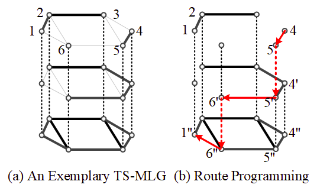

# Introduction to Store-and-Forward (SnF) and the Time-Shifted MultiLayer Graph (TS-MLG) in Optical Circuit-Switched (OCS) Networks

Store-and-Forward ([wiki](https://en.wikipedia.org/wiki/Store_and_forward))
is a scheduling mechanism in network data transfer.
Just as its name, ***SnF stores the data at intermediate network nodes
and transfers them later as scheduled***.
Apart from the routes requests will be sent through,
locations and durations of request storing should also be scheduled. 

The Time-Shifted MultiLayer Graph
([TS-MLG](https://www.osapublishing.org/jocn/abstract.cfm?uri=jocn-8-3-162))
is a mathematical model storing ***physical information and dynamics*** of OCS networks
in a period of time during its SnF process.
The spatial path planning, storage node selection,
and duration scheduling are combined and solved as a shortest-path computing problem.

    
    
An exemplary TS-MLG.

