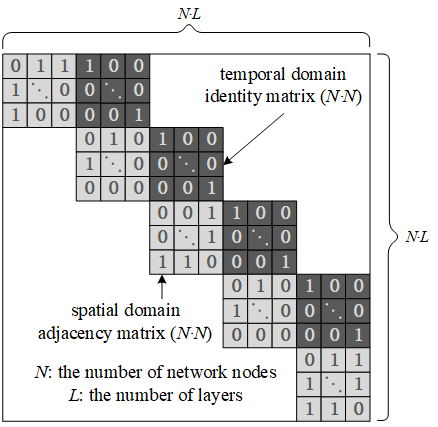
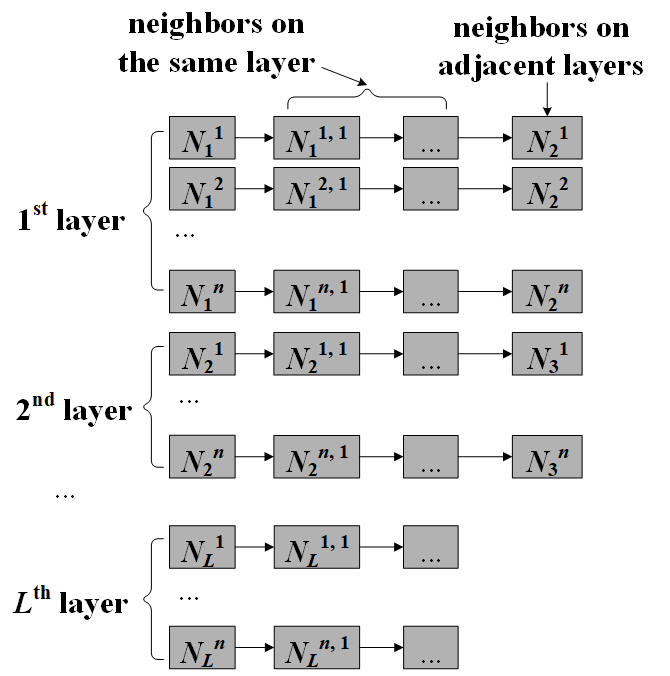
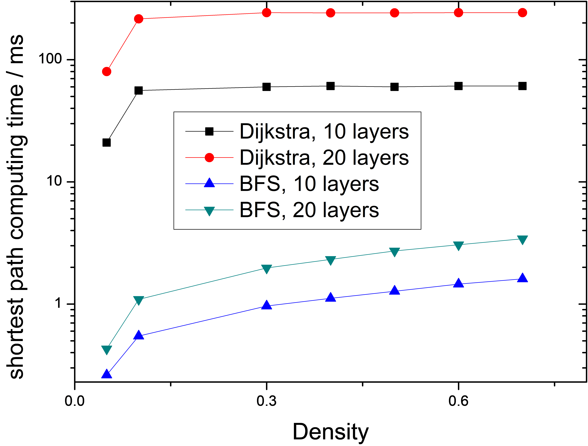
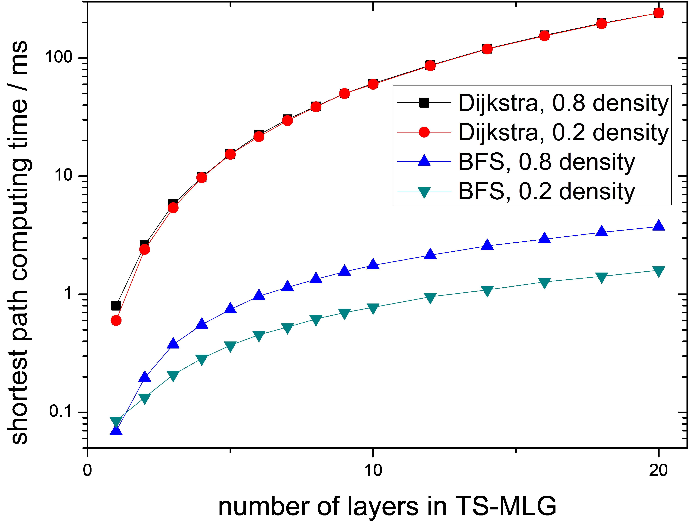
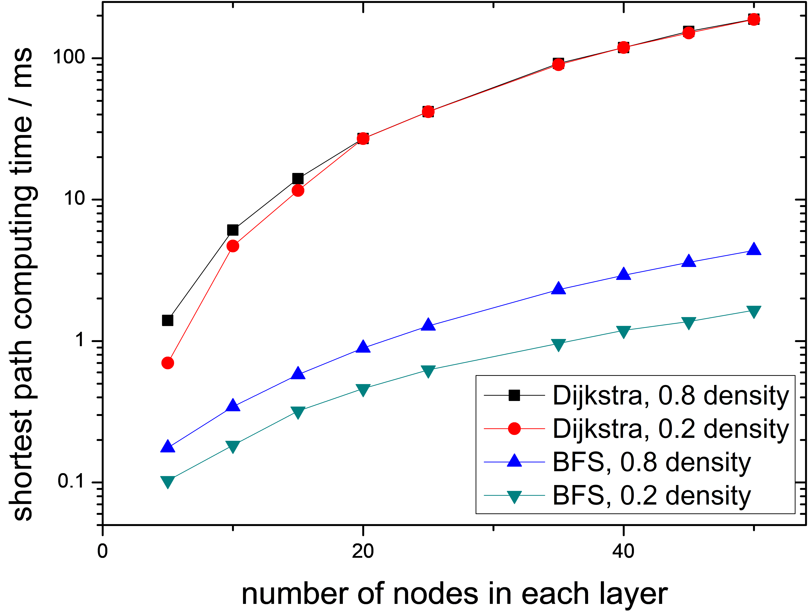

# Improvements on Data Structures and Scheduling Algorithms of Optical Circuit-Switched Network Models

read **[the introduction](intro.md)** first !

TS-MLG is a model with ***sparse edges***, with reasons as follows:

- Networks are sparsely connected.
    In spatial terms, the model has much sparser edges than a fully-connected network, which barely exists.
- Existence of temporal links in TS-MLG obeys specific rules.
    This determines the sparsity of the model in temporal terms.

In this case, adjacency matrices are not the most efficient choice of representation.

Considering its original use ***without edge weight consideration***,
adjacency matrices are replaced by adjacency lists for ***scaling up*** representation of TS-MLG.
The replacement can also be regarded as a scaling up process of request scheduling in SnF.

    
    
    
Replacement of adjacency matrices by adjacency lists.

Meanwhile, the Dijkstra request scheduling algorithm (shortest-path algorithm) in the original model
is replaced by Breadth-First Search algorithm (BFS), which has lower time complexity.

Consider a TS-MLG with N network nodes and L layers (state changes of the network).
The space complexity of single request scheduling will decrease from ***O(N2\*L2)*** to ***O(E)***,
while the time complexity will decrease from ***O(N2\*L2)*** to ***O(N\*L + E)***,
in which E is the number of links in the network.
These are huge reductions in cases in which N and L are large.
In the meantime, without weight consideration,
change of request scheduling algorithm results in ***no different route planning***.

    
    
    
    
Runtime comparisons between Dijkstra and BFS with different graph density, number of layers in TS-MLG, and number of nodes in the network.

Paper:

***[Scaling Up Scheduling in SnF OCS Networks - an Adjacency List Based Solution](https://www.sciencedirect.com/science/article/pii/S1573427718300511)***
